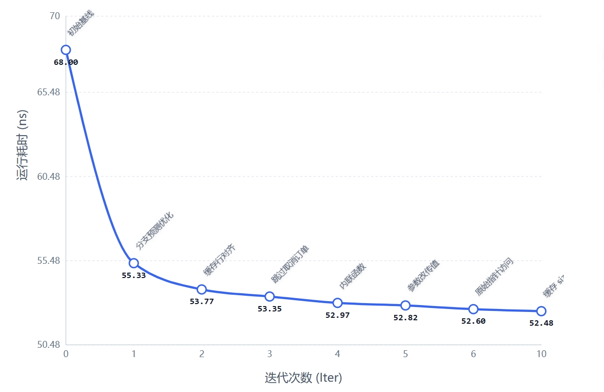

# 🚀 AutoResearch: HFT Order Book 
**Autonomous AI Agent for C++ High-Frequency Trading Micro-Optimizations**

本项目受 Andrej Karpathy 的 [autoresearch](https://github.com/karpathy/autoresearch) 启发，将其“AI 自动化科研迭代”的理念借鉴到了**C++ 极速代码优化**领域。

在这里，我们让 AI Agent（如 Claude 3.5 Sonnet / GPT-4o，运行在 Claude Code，Cursor 里 ）接管到一个极速订单簿撮合引擎项目中 [QuantCup 订单簿撮合引擎](https://github.com/ajtulloch/quantcup-orderbook)，通过无休止的 **“提出假设 ➡️ 修改代码 ➡️ 极限评测 ➡️ Git回滚/提交”** 闭环，通过AI的自主试探，榨干 CPU 的最后一丝性能。

## 💡 核心理念 (The Concept)

在低延迟交易中，几纳秒的延迟都关乎生死。传统的 C++ 性能优化极其枯燥：研发者需要手动尝试各种性能调优，然后跑分验证。

**如果把这个过程完全交给 AI 呢？**
我们为 AI 搭建了一个绝对公平且严苛的“黑箱沙盒”：
1. **严格的单元测试**：以 TDD 方式确保修改的正确性。
2. **稳定的评测栈**：使用标准化的测试数据流 (`score_feed.h`)，并通过定制的 `evaluate.py` 脚本，在 Linux 下利用 绑核、隔离、设置调度优先级等手段消除操作系统噪音，提供极致稳定的性能中位数。
3. **迭代优化机制**：AI 运行脚本 -> 变快了就 `git commit` -> 报错或变慢了就 `git restore .`，可以在极端的时间内完成一轮性能评估，反复迭代。

## 📈 优化成果展示 (The Results)

在30分钟时间里，AI Agent 独立通过Cluade Code，调用GLM 4.7 API完成了 20 次底层 C++ 代码迭代，其中成功 7 次。

**最终战绩：撮合耗时从 `68.00` 降至 `52.48`，全程由 AI 独立完成，获得了 22.8% 的性能提升！**

### 🔬 实验日志 (Experiment Log)

| Iter | 优化假设 / 代码改动说明 | 测试通过? | 运行均值 | 决策 (Keep/Discard) | 失败原因 / 经验总结 |
| :---: | :--- | :---: | :---: | :---: | :--- |
| 0 | 运行未修改的初始原始状态以建立基线 | ✅ | `68.00` | Keep | 基础性能基线，后续的得分必须低于此数值 |
| 1 | 添加分支预测优化 (`__builtin_expect`) 到 order.side 判断和 bookEntry->size < orderSize 比较 | ✅ | `55.33` | **Keep** | 成功提升 18.7%，新基线: 55.33 |
| 2 | 添加缓存行对齐 (`alignas(64)`) 到 OrderBookEntry 结构和热路径变量 | ✅ | `53.77` | **Keep** | 成功提升 2.8%，新基线: 53.77 |
| 3 | 跳过已取消订单 (`size==0`) 并移除冗余的 `erase()` 调用 | ✅ | `53.35` | **Keep** | 成功提升 0.8%，新基线: 53.35 |
| 4 | 内联 `executeTrade` 函数以减少函数调用开销 | ✅ | `52.97` | **Keep** | 成功提升 0.7%，新基线: 52.97 |
| 5 | 将 limit order 参数从引用改为传值 (`t_order&` -> `t_order`) | ✅ | `52.82` | **Keep** | 成功提升 0.3%，新基线: 52.82 |
| 6 | 使用原始指针访问 pricePoints 数组 (`pricePoints.data()`) | ✅ | `52.60` | **Keep** | 成功提升 0.4%，新基线: 52.60 | 
| 7 | 尝试使用原始指针访问 arenaBookEntries 数组 | ✅ | `53.34` | Discard | 性能反而变差，编译器可能已优化迭代器访问 |                                           
| 8 | 尝试添加 `__restrict__` 限定符到 pricePointsPtr | ✅ | `53.93` | Discard | 性能变差，手动添加 restrict 反而阻碍了优化 |    
| 9 | 尝试移除 `cache_last<true>` 配置以优化 `pop_front` 性能 | ❌ | N/A | Discard | 编译错误：`push_back()` 需要该配置 |
| 10 | 缓存 `bookEntry->size` 到局部变量并移除未使用的函数 | ✅ | `52.48` | **Keep** | 成功提升 0.2%，新基线: 52.48 |
| 11 | 尝试添加编译器优化标志 (`-O3`, `-march=native` 等) | ✅ | `52.80` | Discard | 性能变差，构建系统已存在最优选项 |
| 12 | 尝试重新排列 `t_order` 结构体字段以提高缓存局部性 | ❌ | N/A | Discard | 失败：结构体重排破坏了 `test.cpp` 指定初始化器语法 |
| 13 | 尝试优化 `pop_front` 循环模式 | ❌ | N/A | Discard | 失败：段错误，逻辑修改破坏了迭代器正确性 |
| 14 | 使用宏减少代码重复以减少二进制大小 | ✅ | `54.67` | Discard | 性能变差，宏开销或编译器无法优化宏生成代码 |

## 🛠️ 项目架构 (How it works)

本仓库就2个核心文件：

2. **`evaluate.py` (性能评判)**：
   - 使用 CMake + 严格的 Release 模式编译。
   - **运行 TDD 测试**，通过逻辑正确性检验。
   - **防抖动测试**：绑定特定 CPU 核心 (CPU Affinity)，提升至实时抢占优先级，循环测试并取中位数，防止 AI 被系统调度的噪音误导。
3. **`program.md` ( 自主迭代指令)**：
   - 这是一个纯 Markdown 编写的 System Prompt。它向 AI 解释了环境约束、核心指标、决策树（如何做 Git 提交和回滚），以及要求 AI 维护上面的《实验日志》。

## 🤝 致谢 (Acknowledgements)

- 启发自 [Andrej Karpathy - autoresearch](https://github.com/karpathy/autoresearch) 的自动化 AI 研究流。
- 订单簿引擎基座来自[QuantCup Orderbook](https://github.com/ajtulloch/quantcup-orderbook) 的优秀开源实现。 

---
*Disclaimer: This project is an experimental demonstration of AI capabilities in code optimization. HFT systems in production require rigorous validation beyond median benchmark scores.*
